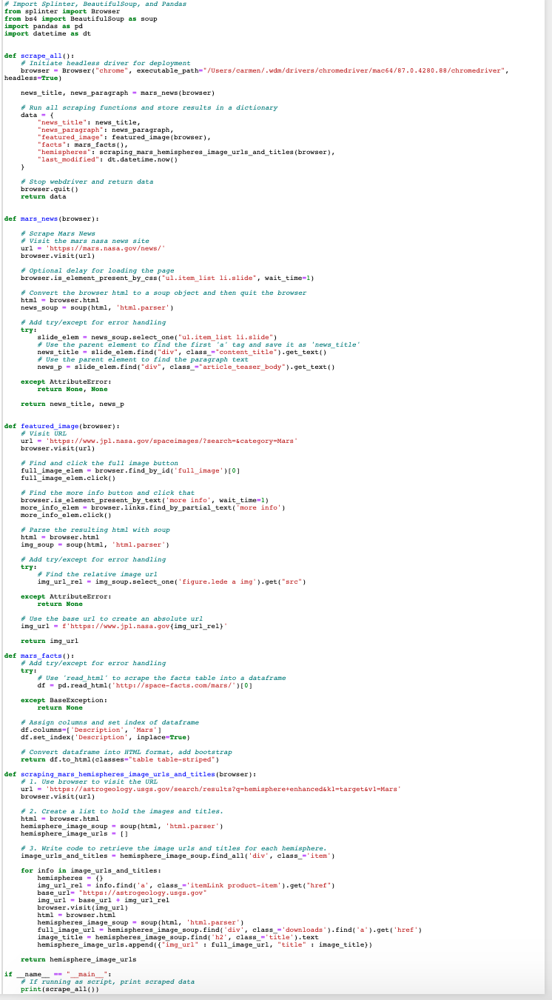

# Mission-to-Mars

## Overall of the analysis

The purpose of this analysis to scrape full-resolution images of Mars’s hemispheres and the titles of those images, store the scraped data on a Mongo database using BeautifulSoup and Splinter. We are to use a web application to display the data, and alter the design of the web app to accommodate these images.

The three technical analyses:

Deliverable 1: Scrape Full-Resolution Mars Hemisphere Images and Titles
Deliverable 2: Update the Web App with Mars Hemisphere Images and Titles
Deliverable 3: Add Bootstrap 3 Components

## Resources:
- Data Source: Mission_to_Mars.ipynb,app.py, scraping.py and index.html
- Software: MongoDB, Python 3.8.3, Visual Studio Code 1.50.0, Flask Version 1.0.2

## Results

### Deliverable 1: Scrape Full-Resolution Mars Hemisphere Images and Titles

### Deliverable 2: Update the Web App with Mars Hemisphere Images and Titles

The scraping.py file contains code that retrieves the full-resolution image URL and title for each hemisphere image

### Deliverable 3: Add Bootstrap 3 Component

Two additional Bootstrap 3 components are used to style the webpage 

